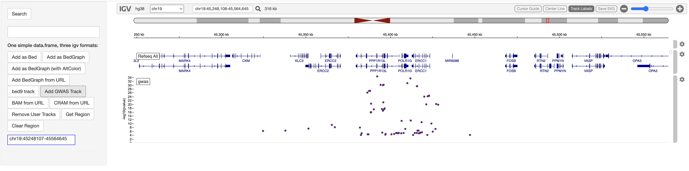

# igvShiny

<!-- badges: start -->
[](https://bioconductor.org/packages/release/bioc/html/igvShiny.html)
[](https://github.com/gladkia/igvShiny/actions/workflows/check-bioc.yml)
[](https://bioconductor.org/packages/stats/bioc/igvShiny/)
[](LICENSE.md)
<!-- badges: end -->

An [htmlwidget](https://www.htmlwidgets.org/) wrapper of the
[Integrative Genomics Viewer (IGV)](https://igv.org/) — embed an interactive
genome browser in your [Shiny](https://shiny.posit.co/) apps, and drive it from
R. One of only two Bioconductor packages bridging IGV to R.

## 🔬 Live demo

**[gladkia-igvshiny-demo.share.connect.posit.cloud](https://gladkia-igvshiny-demo.share.connect.posit.cloud)**

Click through BED / BedGraph / GWAS / BAM / CRAM tracks in a running app — no
install required. (Hosted on [Posit Connect Cloud](https://connect.posit.cloud/);
source in [`demo/posit-connect/`](demo/posit-connect/).)



## Installation

Release version from [Bioconductor](https://bioconductor.org/packages/igvShiny):

```r
if (!require("BiocManager", quietly = TRUE))
    install.packages("BiocManager")
BiocManager::install("igvShiny")
```

Development version from GitHub:

```r
remotes::install_github("gladkia/igvShiny")
```

## Quick start

```r
library(shiny)
library(igvShiny)

options <- parseAndValidateGenomeSpec(genomeName = "hg38", initialLocus = "NDUFS2")

ui <- fluidPage(
  igvShinyOutput("igv")
)

server <- function(input, output, session) {
  output$igv <- renderIgvShiny({
    igvShiny(options)
  })
}

shinyApp(ui, server)
```

From there, load tracks reactively with the `load*Track*` functions
(`loadBedTrack`, `loadBedGraphTrack`, `loadGwasTrack`, `loadBamTrackFromURL`,
`loadCramTrackFromURL`, …) and move the view with `showGenomicRegion()`.

## Features

- Interactive IGV genome browser as a Shiny `htmlwidget`, usable as a Shiny module.
- Stock genomes (hg38, hg19, mm10, tair10, …) and custom genomes from local or remote FASTA.
- Track loaders for BED, BedGraph, bed9, GWAS, SEG, VCF, BAM (URL / local), and CRAM (URL).
- Navigate and query the current view from R (`showGenomicRegion()`, `getGenomicRegion()`).
- Track-click events surfaced back to the Shiny server.

More examples live in [`inst/demos/`](inst/demos/).

## Documentation

- 📦 Reference & articles: <https://gladkia.github.io/igvShiny/>
- 📖 Vignette: `vignette("igvShiny")`
- 🐛 Issues / feature requests: <https://github.com/gladkia/igvShiny/issues>

## Contributing

Contributions are welcome — please open an issue or pull request. The package
follows Bioconductor coding and review standards (see [`AGENTS.md`](AGENTS.md)).

## License

MIT © the igvShiny authors (see [`LICENSE.md`](LICENSE.md) / [`DESCRIPTION`](DESCRIPTION)).
Original author: Paul Shannon. Maintainer: Arkadiusz Gladki.
